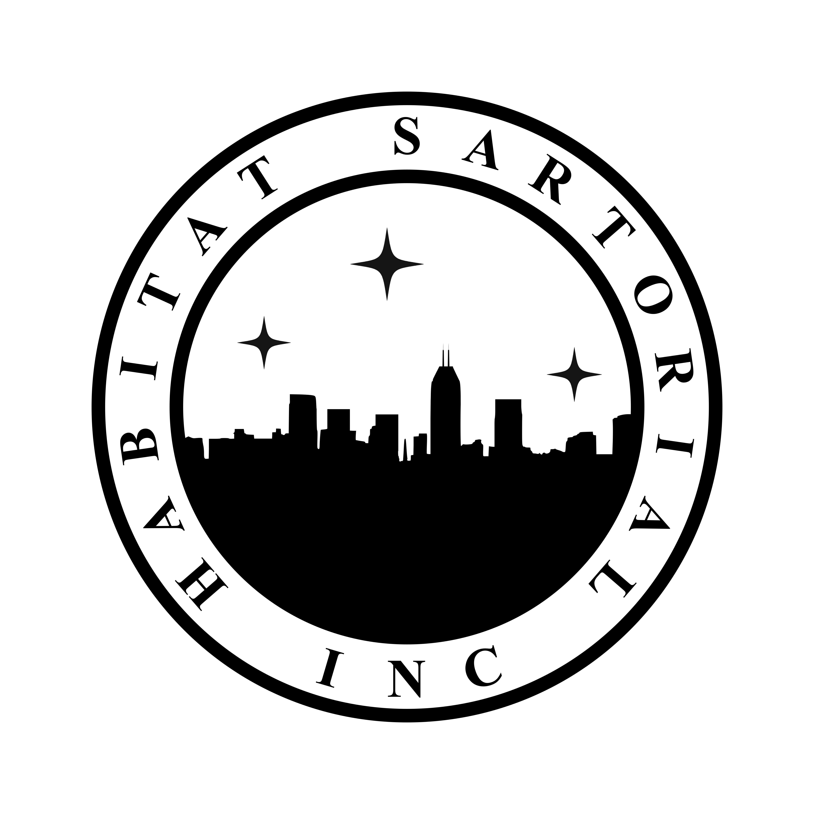
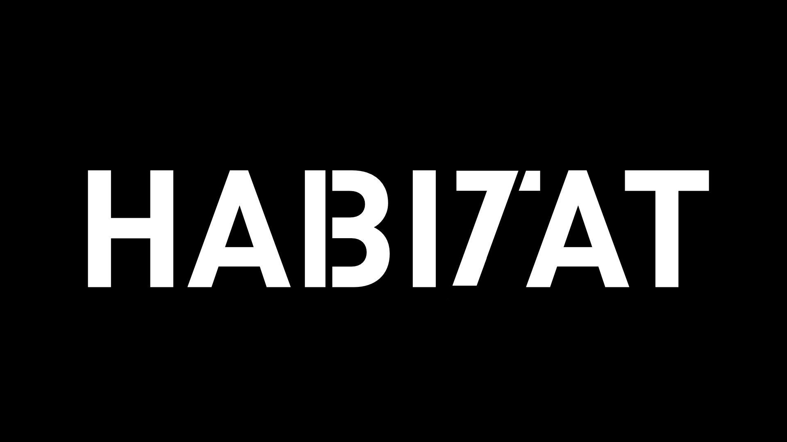
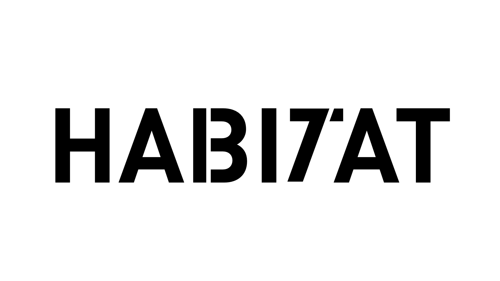

# [Sartorial](https://habitatsartorial.org)

Habitat Sartorial, the not-for-profit, habitat-building fashion center.

This is the commerce website built with react and firebase. Currently hosted at [https://habitatsartorial.org](https://habitatsartorial.org)

### Habitat

In collaboration with Habitat for Humanity. Based in the 317, Indianapolis.

## Todo:

- Email domains
- [x] Add state code to checkout form
- [x] Fix appbar (make cart show below shop)
- Add metadata to paymentIntent (so we can observe what payment is for which besides the intent_id)
- "Order ref: {}", consider telling the user about their order's unique id so they can feel valued
- Automate cloud functions url between dev and prod
- [x] Dl andstudio.lt video intro and use to test video intros
- Stylistic changes
  - [x] fade transitions (cp andstudio.lt)
  - [x] Cart view is gross, as are most other views
  - [x] Hover to show image preview
  - [x] Darkmode to Sponsors page
  - Change button color scheme to be more universal and less generic. Probably to a slick black & white
  - Hide navbar on scroll down, show on scroll up.
- Add realistic content

